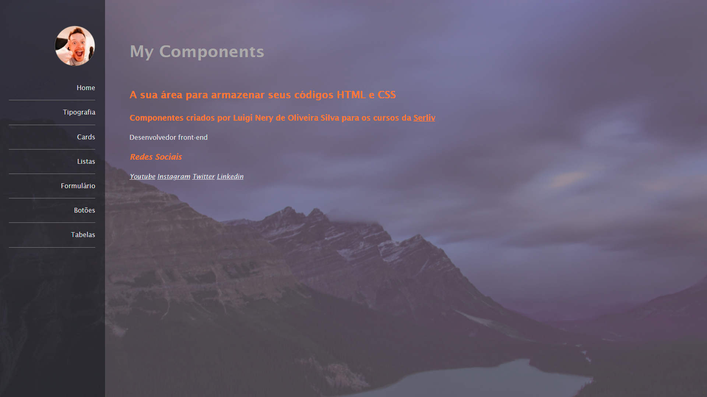

MyComponents is a study project exploring various HTML elements and structures, including working with multiple pages, typography, cards, lists, forms, buttons, and tables. Additionally, CSS was used to style the project, enhancing the visual presentation and user experience. This project helped me refine my understanding of HTML's core components and how to effectively style them using CSS.

**[See Page](https://luigineryproject7.netlify.app)**  

